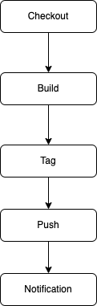

# Hello‑Docker

這是一個簡單的 Node.js Hello‑World 應用範例，示範如何使用 Docker 打包。

## 本地建構與執行

1. **Clone 本專案**  
   ```bash
   git clone https://github.com/YanYuTu/NTU-CNAD-HW4.git
   cd NTU-CNAD-HW4
   ```
2. **檢查程式碼**  
確保目錄下有以下檔案：
   * package.json
   * index.js
   * Dockerfile

3. **建構 Docker 映像**
   ```bash
   docker build -t wesleytu/2025cloud:latest .
   ```
4. **Run container**  
   直接從 Docker Hub 拉取已上傳的映像並執行：
   ```bash
   docker run --rm wesleytu/2025cloud:latest  
   ```
   或使用本機 build 出來的：
   ```bash
   docker run --rm wesleytu/2025cloud:latest
   ```  
5. **Automated Build & Tagging Logic**
   1. **何時觸發**  
      - Push 到 `main` branch  
      - Pull Request 建立或更新  

   2. **流程圖**  
        

   3. **Tag 選擇邏輯**  
      - `latest`：針對任何 `main` Push，自動覆寫為最新穩定版  
      - `<commit-sha>`：對每次 Build 都用該次 Commit SHA，方便追溯歷史  
      - 未來可擴充：加入 `semver` 標籤 (e.g. `v1.0.0`)  
   
   > **設計重點**：  
   > - **安全穩定**：`latest` 保持最新穩定映像  
   > - **可追蹤**：SHA Tag 幫助回溯與除錯  
   > - **易擴充**：可在 Action 中新增分支/Tag 規則  
